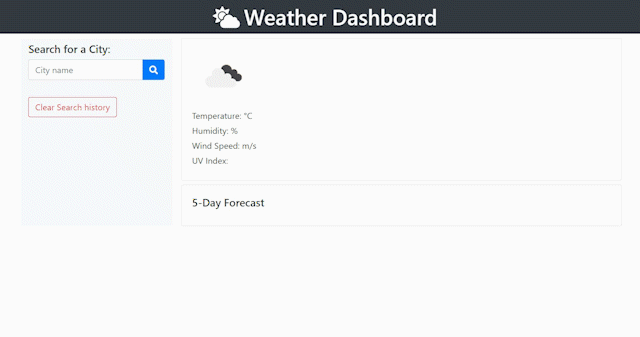

# Weather Dashboard   

**Weather Dashboard** - A simple weather dashboard web app which will get and show weather outlook for multiple cities to help plan a trip. App uses the [OpenWeather API](https://openweathermap.org/api) to retrieve weather data for cities. HTTP requests are implemented with use of AJAX, JSON to get data from third-party server-side API.

## Installation

Web Application can be accessed at [elogonme.github.io/weather-dashboard/](https://elogonme.github.io/weather-dashboard/)

## Usage

Enter city name in the search field and click search button.
When city is found the current weather and 5-day forecast will be displayed.
History of searched cities will be also displayed in search list. User can click any city in the history list to display data immediately. 

## Repository

All web app `code` is available at repository [github.com/elogonme/weather-dashboard](https://github.com/elogonme/work-scheduler)

## Credits

Coded by Eldar Humbatov [github.com/elogonme](https://github.com/elogonme)

## License

This source code is available to everyone under the standard 
